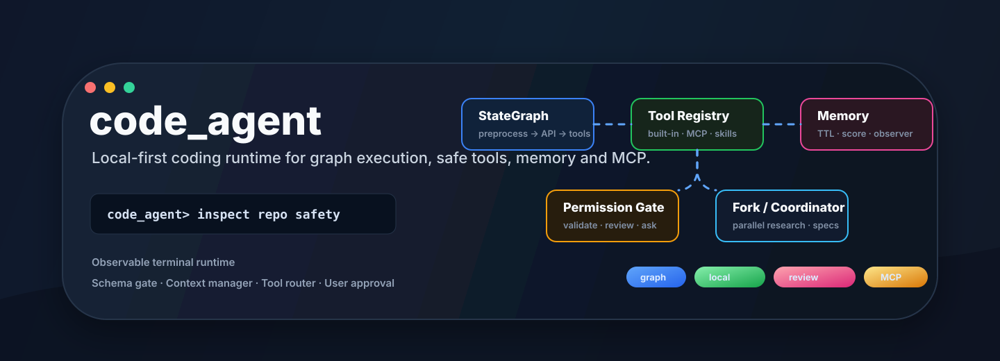
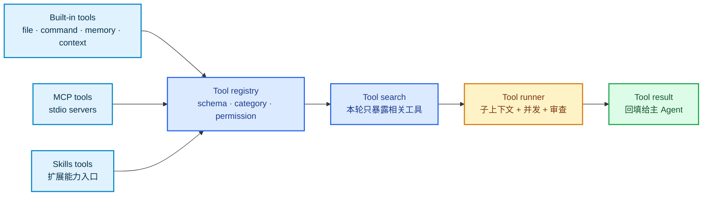
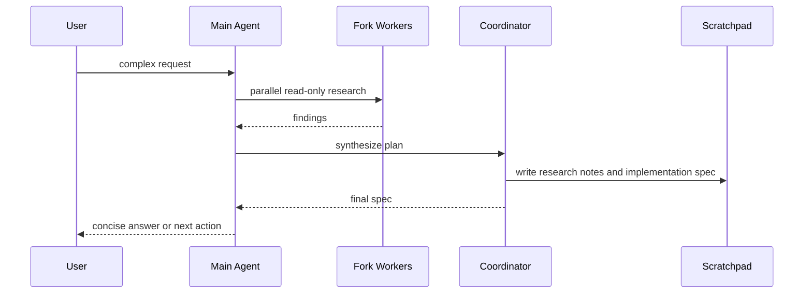

# code_agent

<p align="center">
  
</p>

<p align="center">
  <a href="https://github.com/Anorlx/code_agent"></a>
  
  
  
  
</p>

> 一个本地优先的 Python Coding Agent：主循环由 LangGraph 驱动，工具调用经过 schema 校验和权限审查，长期记忆、上下文压缩、MCP 接入、Fork 并行调查和 Coordinator 规划被组织成一套可观察的 Agent 工程。


## 🧭 Project Console

| 入口 | 看什么 | 关键位置 |
| --- | --- | --- |
| Runtime | 一轮任务如何从输入、模型、工具到结果回填 | `agent/main_agent/graph.py` |
| Tools | 内置工具、MCP 工具、skills 工具如何统一注册 | `agent/tools/registry.py` |
| Safety | 工具参数、风险等级、用户确认如何串起来 | `agent/sub_agent/tool_runner.py`, `agent/sub_agent/permission_review.py` |
| Memory | 长期记忆如何保存、衰减、检索和观察 | `agent/memory_system/` |
| Orchestration | Fork 并行调查和 Coordinator 生成实施规格 | `agent/fork/`, `agent/Coordinator/` |

<details open>
<summary><b>展开：这个项目真正解决的事</b></summary>

`code_agent` 不是只把模型接到 terminal。它更像一个小型 Agent runtime：主 Agent 负责判断任务方向，工具系统负责把能力以 schema 暴露出来，权限管线负责把高风险动作挡在用户确认前，上下文管理负责让长任务继续跑，记忆系统负责保留跨会话线索，多 Agent 编排负责把复杂问题拆成并行研究和综合规格。

</details>

---

## 🧠 Runtime Map

```mermaid
flowchart TB
    accTitle: code_agent Runtime Map
    accDescr: A user request enters the terminal, goes through memory retrieval, graph preprocessing, model streaming, tool execution, result backfill, session persistence and memory observation.

    user_input([用户输入]) --> terminal["Terminal UI<br/>chat_loop"]
    terminal --> memory_lookup["Memory retrieval<br/>相关长期记忆"]
    memory_lookup --> graph["LangGraph run_agent"]

    subgraph state_graph ["StateGraph"]
        preprocess["preprocess<br/>上下文管理 + 工具选择"]
        api_call["api_call<br/>模型流式输出"]
        has_tools{"tool_calls?"}
        tool_execution["tool_execution<br/>工具校验 + 权限审查"]
        result_backfill["result_backfill<br/>工具结果回填"]
        finish["termination_check"]

        preprocess --> api_call
        api_call --> has_tools
        has_tools -->|yes| tool_execution
        tool_execution --> result_backfill
        result_backfill --> preprocess
        has_tools -->|no| finish
    end

    graph --> preprocess
    finish --> session_store["Session store<br/>SQLite messages"]
    session_store --> memory_observer["Memory observer<br/>后台提炼长期线索"]

    classDef terminal fill:#e0f2fe,stroke:#0284c7,stroke-width:2px,color:#082f49
    classDef graph fill:#dbeafe,stroke:#2563eb,stroke-width:2px,color:#1e3a8a
    classDef tool fill:#fef3c7,stroke:#d97706,stroke-width:2px,color:#78350f
    classDef memory fill:#fce7f3,stroke:#db2777,stroke-width:2px,color:#831843
    classDef done fill:#dcfce7,stroke:#16a34a,stroke-width:2px,color:#14532d

    class user_input,terminal terminal
    class graph,preprocess,api_call,result_backfill graph
    class has_tools,tool_execution tool
    class memory_lookup,memory_observer,session_store memory
    class finish done
```

## 🛡️ Permission Review

工具执行不是直接放行，而是按同一条安全管线处理：

| 阶段 | 作用 |
| --- | --- |
| `validateInput` | 按 function schema 校验必填字段、类型和枚举 |
| `hasPermissionsToUseTool` | 读取工具权限配置，识别 `deny`、`ask`、`requires_review` |
| `checkPermissions` | 结合上下文判断工具风险，比如命令执行、文件写入、MCP 调用 |
| `interactivePrompt` | 风险不确定或需要确认时，把选择权交还给用户 |

<p align="center">
  
</p>

截图里的 `run_command` 调用在 `validateInput` 阶段被拦住：模型传入的 `command` 不是 schema 要求的数组，所以系统标记为 `ask`，展示风险、阶段和原因，再等待用户本次允许或拒绝。

<details>
<summary><b>展开：为什么这块重要</b></summary>

Agent 做工程任务时，最危险的不是“回答错”，而是把不确定的工具动作静默执行。这个项目把参数校验、权限策略、上下文风险和用户确认放到同一条路径上，让工具执行变成可解释、可审查、可中断的行为。

</details>

---

## 🔌 Tool System



<details>
<summary><b>展开：内置工具、MCP、skills 的边界</b></summary>

| 类型 | 当前角色 | 例子 |
| --- | --- | --- |
| 内置工具 | 项目内文件、命令、记忆、上下文等核心能力 | `read_project_file`, `run_command`, `save_memory`, `snip_context` |
| MCP 工具 | 通过 `.mcp.json` 和 `agent/tools/mcp` 接入外部能力 | `amap-maps`, `tavily` |
| Skills 工具 | 为后续可插拔技能预留统一入口 | `agent/tools/skills` |

所有工具最终都会变成同一种 function schema，交给 `tool_runner` 统一执行。

</details>

---

## 🧩 Multi-Agent Orchestration

| 模式 | 适合什么任务 | 约束 |
| --- | --- | --- |
| Fork | 多个互不依赖的只读调查，比如分别分析几个模块 | worker 继承主上下文，worker 之间不通信，不递归创建子 Agent |
| Coordinator | 复杂工程任务的研究和规格生成 | 先 Research，再 Synthesis，当前不自动并发改代码 |



## 🧱 Project Structure

```text
agent/
  main_agent/        terminal loop, StateGraph runtime, model streaming, context manager
  sub_agent/         tool search, tool runner, permission review, memory/session helpers
  tools/             built-in tools, MCP bridge, skills bridge, unified registry
  memory_system/     long-term memory store and observer
  fork/              parallel read-only worker orchestration
  Coordinator/       research + synthesis coordinator and scratchpad writer
assets/              README visuals and terminal screenshots
main.py              local entrypoint
```

## 🚀 Quick Start

```bash
git clone https://github.com/Anorlx/code_agent.git
cd code_agent
export DASHSCOPE_API_KEY="你的 DashScope API Key"
python3 main.py
```

运行后进入 `code_agent>`，你会看到模型流式输出、工具调用、权限审查、token 统计和上下文管理事件。

<details>
<summary><b>展开：一次终端事件长什么样</b></summary>

```text
state       turn=2 phase=API调用 tools read_project_file
tool_call   read_project_file path=agent/main_agent/graph.py
review      read_project_file allow risk=low
tool_done   read_project_file
token       dashscope_usage in=... out=... total=...
context     micro_compact freed≈...
```

</details>

---

## 📌 Design Principles

| 原则 | 含义 |
| --- | --- |
| Local-first | 会话、记忆、日志和工具工作区默认留在本地 |
| Observable | 主图状态、工具调用、权限审查、token 和上下文变化都在 terminal 暴露 |
| Permission-aware | 写文件、命令执行、删除、MCP 等能力进入统一审查路径 |
| Context-conscious | 通过 snip、micro compact、collapse、auto compact 降低长任务上下文压力 |
| Composable | 主 Agent、子 Agent、工具、MCP、Fork、Coordinator 边界清楚，可以继续扩展 |

