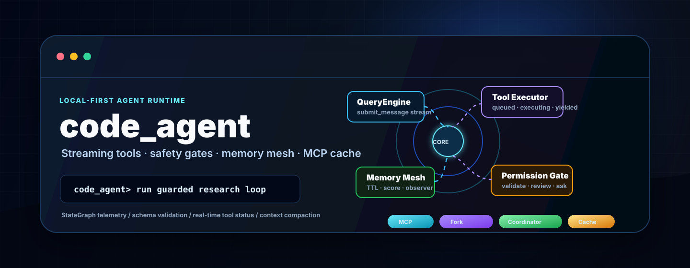
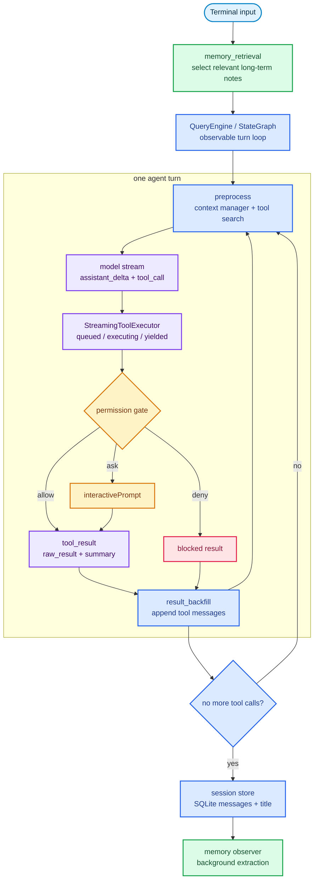
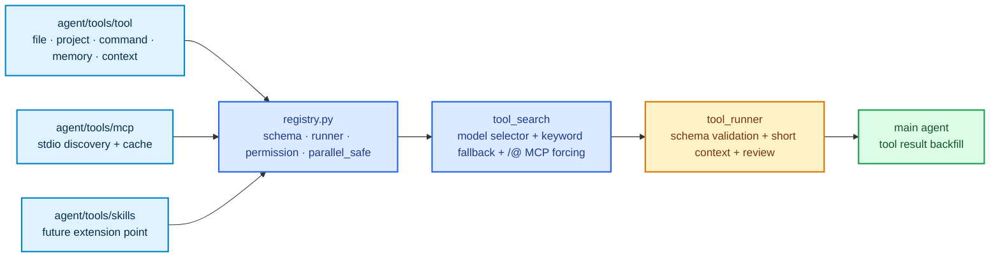
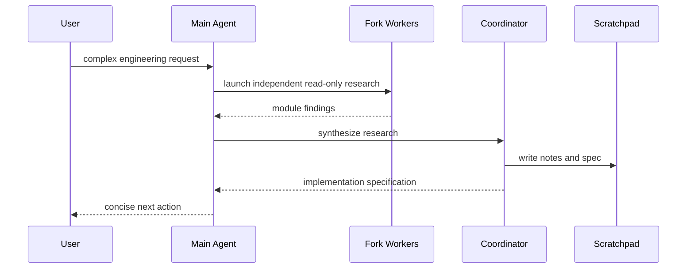
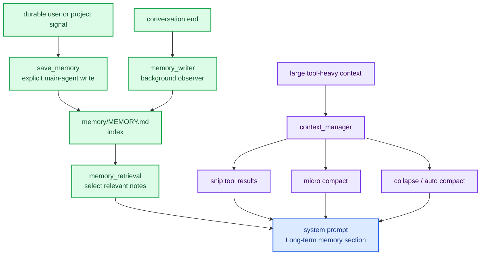

# code_agent

<p align="center">
  
</p>

<p align="center">
  <a href="https://github.com/Anorlx/code_agent"></a>
  
  
  
  
  
</p>

_一个本地优先的 Python Coding Agent runtime：模型流式输出、工具实时执行、权限审查、长期记忆、MCP 动态工具、Fork 并行调查和 Coordinator 规划被组织成一套可观察、可扩展、可控的 Agent 系统。_

> `MAIN_README.md` 是 GitHub 首页的维护源。需要展示到仓库首页时，把它同步到根目录 `README.md` 即可。

## 🧭 system console

| Layer | Capability | Core files |
| --- | --- | --- |
| Runtime core | `QueryEngine.submit_message` 流式事件循环，兼容 StateGraph 运行链路 | `agent/main_agent/query_engine.py`, `agent/main_agent/graph.py` |
| Terminal cockpit | 会话选择、流式输出、工具状态、权限确认、token/context 事件 | `agent/main_agent/cli.py`, `agent/main_agent/terminal_ui.py` |
| Tool fabric | 内置工具、MCP 工具、skills 预留统一成 function schema | `agent/tools/registry.py`, `agent/tools/tool/`, `agent/tools/mcp/`, `agent/tools/skills/` |
| Safety gate | schema 校验、权限规则、上下文审查、用户确认 | `agent/sub_agent/tool_runner.py`, `agent/sub_agent/permission_review.py` |
| Context engine | snip、micro compact、collapse、auto compact，支撑长任务运行 | `agent/main_agent/context_manager.py` |
| Memory mesh | 长期记忆索引、TTL、score、后台观察和检索 | `agent/memory_system/`, `agent/sub_agent/memory_retrieval.py` |
| Orchestration | Fork worker 并行只读调查，Coordinator 生成实施规格 | `agent/fork/`, `agent/Coordinator/` |

<details open>
<summary><b>当前项目画像</b></summary>

`code_agent` 已经不是“模型 + 几个工具”的 demo，而是一个正在成型的本地 Agent runtime。它把用户输入拆进可观察的事件流：模型边输出，工具边进入队列；只读工具可以并发推进，写入和命令类动作会进入权限门；MCP 工具动态发现并缓存；长任务过程中上下文会被压缩；跨会话线索由长期记忆系统维护；复杂任务可以交给 Fork 或 Coordinator 做并行研究和规格综合。

</details>

---

## 🧠 runtime topology



## ⚡ streaming tool execution

`QueryEngine` 里新增的 `StreamingToolExecutor` 让工具调用不再只是“模型输出结束后批量执行”。它会在流式事件中捕获 tool call，立刻进入队列，并把工具状态作为事件吐给 terminal。

| Status | Meaning |
| --- | --- |
| `queued` | 工具调用已被捕获，等待执行窗口 |
| `executing` | 工具正在通过 `tool_runner` 审查和执行 |
| `completed` | 工具任务完成，等待按顺序回填 |
| `yielded` | 工具结果已经回填给主 Agent |
| `cancelled` | 兄弟 `run_command` 失败后，正在执行的 sibling 被取消 |

<details>
<summary><b>展开：并发策略</b></summary>

只读、低风险、标记为 `parallel_safe` 的工具可以一起跑；写文件、删文件、命令执行、Fork/Coordinator 这类动作会串行或进入确认。这样终端体验更快，但不会把危险动作混进并发池。

</details>

---

## 🛡️ permission gate

工具执行前会走统一的安全门，而不是让模型直接碰文件、命令或外部 MCP。

| Stage | What it checks | Result |
| --- | --- | --- |
| `validateInput` | 参数是否符合 function schema：必填字段、类型、枚举 | 不合法时 `ask` |
| `hasPermissionsToUseTool` | 工具权限配置：`allow`、`ask`、`deny`、`requires_review` | 显式规则优先 |
| `checkPermissions` | 当前上下文里的真实风险：命令、写入、删除、联网、MCP | 输出 risk/reason |
| `interactivePrompt` | 用户确认本次是否允许 | terminal 决策 |

<p align="center">
  
</p>

截图里的 `run_command` 被 `validateInput` 拦住：`command` 参数不是 schema 要求的数组，所以系统展示风险、阶段和原因，等待用户本次允许或拒绝。

## 🔌 tool fabric



<details>
<summary><b>展开：MCP 现在怎么接入</b></summary>

`agent/tools/mcp/` 会从 `.mcp.json` 发现 stdio MCP server，拉取远端 tools，注册成 `mcp__server__tool`。新增的 `cache.py` 会把工具 schema 缓存在 `.agent_data/mcp_tools_cache.json`，用配置指纹和 TTL 避免每次启动都重新发现。Terminal 里 `/@` 可以强制本轮优先使用某个 MCP server。

</details>

---

## 🧩 orchestration layer

| Mode | Job | Boundary |
| --- | --- | --- |
| Fork | 多个独立方向并行只读调查，比如分别审查模块、比较方案、搜索证据 | worker 继承主上下文，互不通信，不递归创建子 Agent |
| Coordinator | 复杂工程任务的 Research + Synthesis，生成实施规格 | 当前 v1 写 scratchpad，不直接并发改代码 |



## 🧬 memory and context



## 🧱 project matrix

```text
agent/
  main_agent/
    query_engine.py       streaming submit_message runtime
    graph.py              LangGraph StateGraph runtime
    context_manager.py    snip / micro compact / collapse / auto compact
    terminal_ui.py        terminal cockpit panels and events
  sub_agent/
    tool_search.py        tool selection, /@ MCP forcing, fallback rules
    tool_runner.py        schema validation, permission merge, execution events
    permission_review.py  risk review for commands, file writes, MCP and memory
  tools/
    tool/                 built-in local tools
    mcp/                  stdio MCP discovery, registry, settings and cache
    skills/               future skills bridge
    registry.py           unified tool catalog
  memory_system/          long-term memory store and observer
  fork/                   parallel read-only worker mode
  Coordinator/            research + synthesis planner and scratchpad writer
assets/                   README visuals and permission screenshot
main.py                   local entrypoint
```

## 🚀 quick start

```bash
git clone https://github.com/Anorlx/code_agent.git
cd code_agent
export DASHSCOPE_API_KEY="你的 DashScope API Key"
python3 main.py
```

<details>
<summary><b>展开：terminal 里会看到什么</b></summary>

```text
state       turn=1 phase=API调用 tools read_project_file,mcp__tavily__search
tool_status read_project_file queued parallel_safe=true
tool_status read_project_file executing
review      read_project_file allow risk=low
tool_done   read_project_file
token       dashscope_usage in=... out=... total=...
context     micro_compact freed≈...
```

</details>

---

## 📌 design principles

| Principle | Implementation |
| --- | --- |
| Local-first | session、memory、scratchpad、MCP cache 都在本地项目数据区 |
| Observable by default | 每轮状态、工具状态、权限审查、token 和上下文动作都发 terminal event |
| Permission-aware | 文件写入、删除、命令、MCP、编排工具统一进入审查路径 |
| Streaming-first | 模型输出和工具执行可以在同一轮事件流里推进 |
| Context-conscious | 大上下文通过 snip、compact、collapse 控制，不靠硬塞 |
| Extensible | 内置工具、MCP、skills、Fork、Coordinator 都通过清晰边界继续扩展 |

